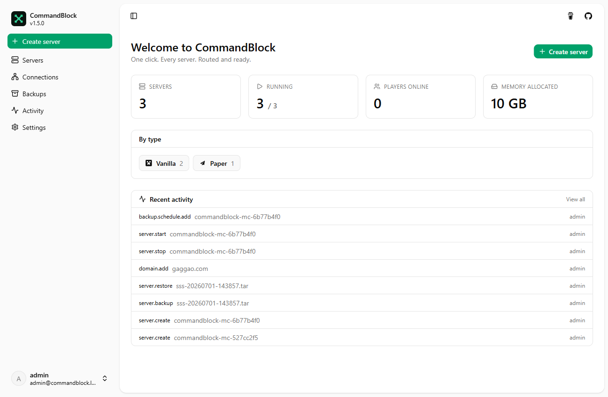
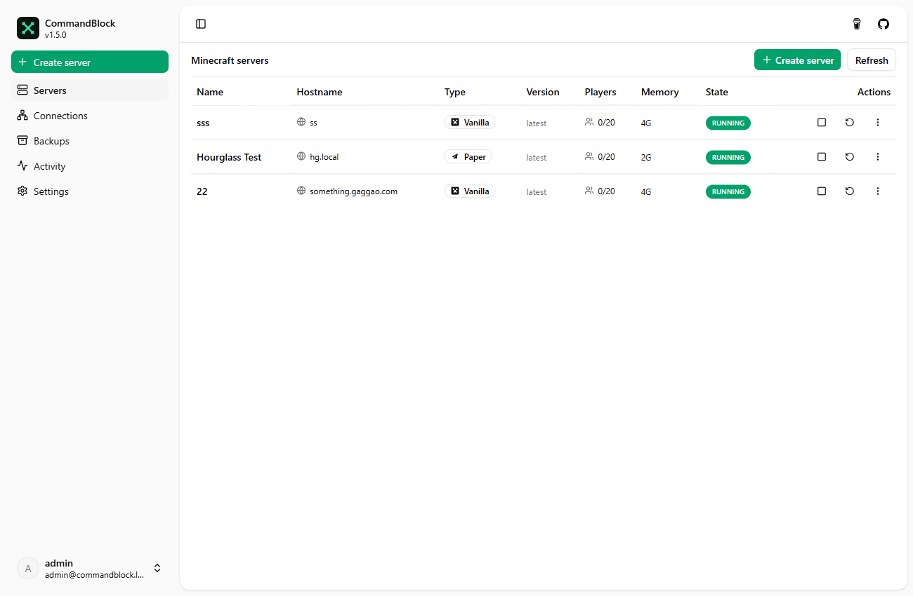
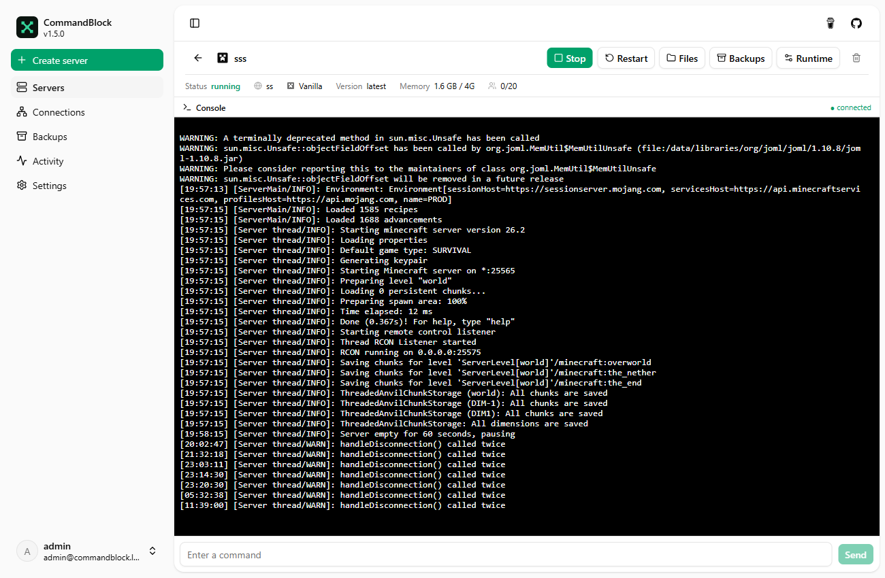
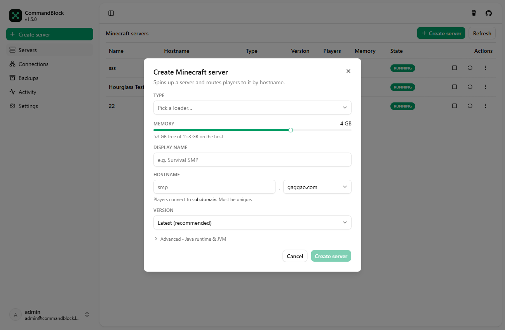
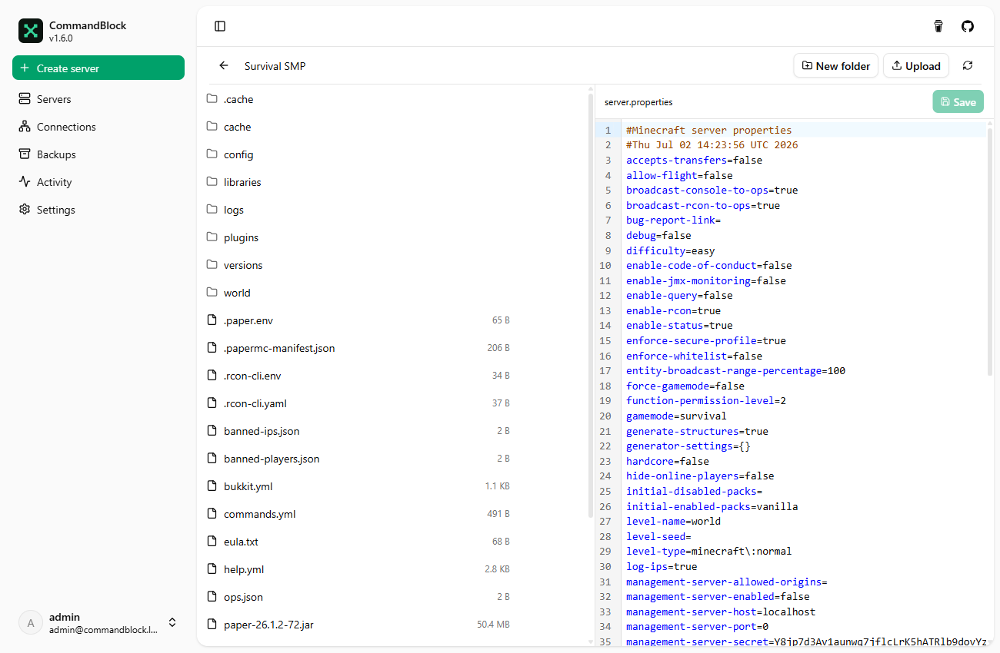
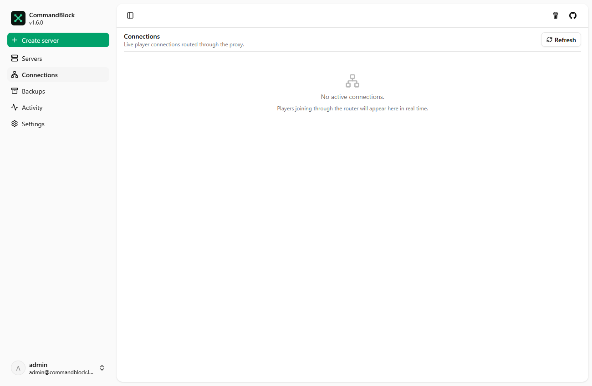
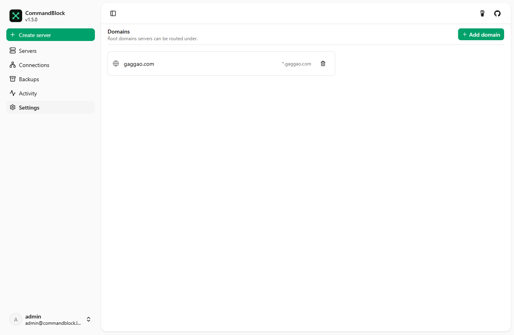
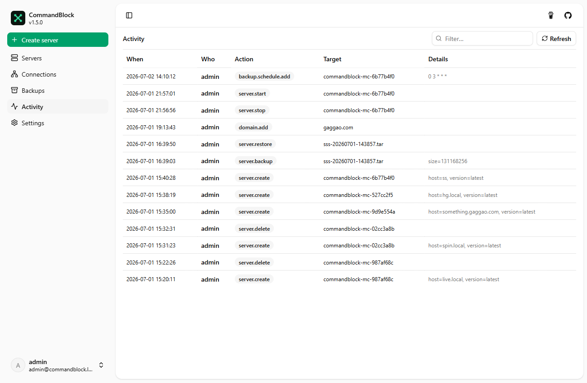

  

  <strong>CommandBlock</strong> 
  One click. Every server. Routed and ready.

  
  
  
  

---

> **Heads up:** CommandBlock is in early development. Expect rough edges and breaking changes between versions.

## What is CommandBlock?

CommandBlock is a self-hosted manager for Minecraft (Java) servers. Pick a loader, click Create, and you get a running server in its own container - reachable by its own hostname through a single public port. Manage, back up, and restore it all from one UI.

## Screenshots

  
  

  
  

<strong>Show more screenshots</strong>

  
  

  
  

## Features

- **One-click servers**: Vanilla, Paper, Purpur, Fabric, Quilt, Forge, NeoForge and Spigot, on any Minecraft version that ships a server jar (built on [`itzg/minecraft-server`](https://github.com/itzg/docker-minecraft-server)).
- **One port, many servers**: a built-in router reads the hostname from the Minecraft handshake and forwards `smp.example.com`, `modded.example.com`, … to the right server - all on 25565.
- **Backups & cloning**: world or full-server snapshots to SeaweedFS or any S3 bucket - restore in place, schedule with cron, or spin up a new server from a backup.
- **Wake & sleep**: auto-sleep a server when it goes idle and start it again when someone joins, holding the player until it's ready instead of making them reconnect - on every version and every mod loader.
- **Any client version**: optionally install the Via stack so 1.8 through current clients share one server, with authentication untouched.
- **Edit from the UI**: a per-server settings modal - `server.properties` with a live MOTD editor, Java/memory runtime, the Minecraft version, custom icon, and rename.
- **Lifecycle**: start, stop, restart and delete, with live vitals per server and a router view of who's connected, wake times and turned-away joins.
- **OIDC auth**: bring your own provider (Pocket ID, Authentik, Auth0…), or the bundled mock server for local dev.

## Get started

- 📦 **[Self-hosting guide](https://docs.commandblock.pianonic.ch/self-host)** - run the image with `docker compose`.
- 😴 **[Wake & sleep](https://docs.commandblock.pianonic.ch/wake)** - idle servers that start themselves when a player joins.
- 🛠️ **[Developer setup](https://docs.commandblock.pianonic.ch/dev-setup)** - local dev with `dotnet run` + Bun, migrations, tests.

Full documentation: **[docs.commandblock.pianonic.ch](https://docs.commandblock.pianonic.ch)**

<strong>Tech stack</strong>

- **.NET 10** ASP.NET Core API (Mediator, EF Core, Clean Architecture).
- **Angular 21** + Signals + Spartan UI.
- **Docker.DotNet** for the server-container lifecycle; **`itzg/minecraft-server`** as the server image.
- **Raw-TCP router** that parses the Minecraft handshake to route by hostname.
- **AWS SDK for .NET** for S3/SeaweedFS backups.
- **OIDC** auth; **OpenAPI** client via `bun run apigen`.

## License

TBD.

---

Made with care by <a href="https://github.com/PianoNic">PianoNic</a>

